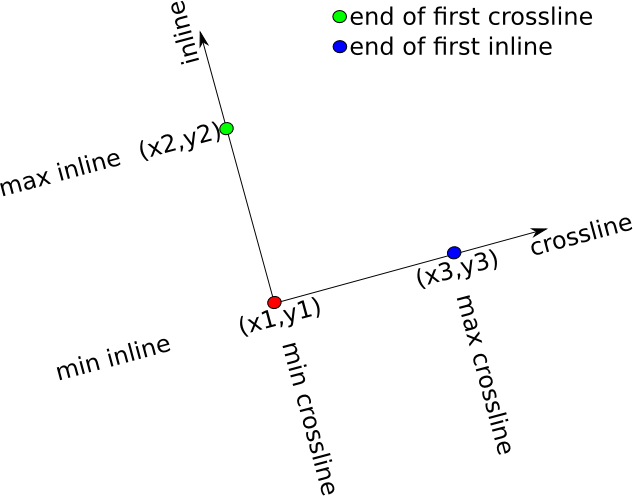

[](https://travis-ci.org/ChevronETC/TeaSeis.jl)
[](https://coveralls.io/github/ChevronETC/TeaSeis.jl?branch=master)

<h1>TeaSeis.jl</h1>
TeaSeis.jl is a Julia library for reading and writing JavaSeis files (The name `TeaSeis.jl` was chosen instead of `JavaSeis.jl` due to potential trademark issues).  The JavaSeis file format is used in various software projects including <a href=https://www.landmark.solutions/seisspace-promax>SeisSpace</a>.  The original library is written in <a href=http://sourceforge.net/projects/javaseis>Java</a>.  There are also <a href=http://www.jseisio.com>C++</a> and <a href=https://github.com/asbjorn/pyjavaseis>Python</a> implementations available.  Similar to the C++ library, TeaSeis.jl is a stripped down version of the original Java library.  In particular, the intent is to only supply methods for reading and writing from and to JavaSeis files.

```@contents
depth = 3
```

# Trademarks
* SEISSPACE and PROMAX are registered trademarks of LANDMARK GRAPHICS CORPORATION
* Java is a registred trademark of Oracle

# License and copyright
The License and copyright information can be found in the source distribution: `LICENSE.txt`, `COPYRIGHT.txt`

# Dependencies
TeaSeis.jl depends on the [LightXML.jl](http://www.github.com/lindahua/LightXML.jl) package.

# Obtaining TeaSeis.jl

    Pkg.add("TeaSeis")

# Using TeaSeis.jl

## Quick start guide

First, load  the TeaSeis.jl library:
```julia
using TeaSeis
```

## writing

* Create a new JavaSeis file with a 3D framework (128 samples per trace, 32 traces per frame, and 16 frames per volume):

```julia
io = jsopen("filename.js", "w", axis_lengths=[128, 32, 16])
```

Note that by default, `SAMPLE`, `TRACE`, and `FRAME` will be the axes properties.

* Allocate traces and headers for a single frame:

```julia
trcs, hdrs = allocframe(io)
```

* Populate `trcs`, and `hdrs` with values.  For example, write random values to all traces in the first frame:

```julia
map(i->set!(prop(io, stockprop[:TRC_TYPE]), hdrs, i, tracetype[:live]), 1:size(io,2))
map(i->set!(prop(io, stockprop[:TRACE]   ), hdrs, i, i               ), 1:size(io,2))
map(i->set!(prop(io, stockprop[:FRAME]   ), hdrs, i, 1               ), 1:size(io,2))
rand!(trcs)
writeframe(io, trcs, hdrs)
```

* Close the file

```julia
close(io)
```

## reading

* Open a new JavaSeis file from an existing dataset:

```julia
io = jsopen("filename.js", "r")
```

* Read the first frame:

```julia
trcs, hdrs = readframe(io, 1)
```
or a similar in-place version:
```julia
trcs, hdrs = allocframe(io)
readframe!(io, trcs, hdrs, 1)
```

* Access values stored in a trace property for the first trace in the frame:

```julia
get(prop(io, stockprop[:TRACE]), hdrs, 1)
```
or, slightly less efficient:
```julia
get(prop(io, stockprop[:TRACE]), hdrs[:,1])
```

* Close the file
```julia
close(io)
```

# jsopen / jscreate
A JavaSeis dataset is created/opened with the `jsopen` method which returns a `JSeis`.
A JavaSeis dataset must have a minimum of 3 dimensions.  

Create a 3D JavaSeis file with 10 samples per trace, 11 traces per frame, and 12 frames per volume:
```julia
io = jsopen("file.js", "w", axis_lengths=[10,11,12])
```
Open an existing JavaSeis file in read-only mode:
```julia
io = jsopen("file.js", "r")
io = jsopen("file.js")      # equivalent to previous line
```
Open an existing JavaSeis file for reading and writing:
```julia
io = jsopen("file.js", "r+")
```

To close an open dataset:
```julia
close(io)
```

To create a dataset:
```julia
jscreate("file.js", axis_lengths=[10,11,12])
```
This is useful for when you need to create the data-set on the master process, and write to it on worker processes.

# Available options when creating a new JavaSeis file

The `jscreate` and, when operating in write `"w"` mode, `jsopen` functions take the following named optional arguments:

* `similarto::String`<br>
An existing JavaSeis dataset.  If set, then all other named arguments can be used to modify the data context that belongs to the existing JavaSeis dataset.

* `description::String`<br>
Description of dataset, if not set, then a description is parsed from the filename.

* `mapped::Bool`<br>
If the dataset is full (no missing frames/traces), then it may be more efficient to set this to `false`.  Defaults to `true`.

* `nextents::Int`<br>
The number of file-extents used to store the data.  If not set, then a heuristic is used to choose the number of extents.

* `secondaries::Array{String, 1}`<br>
An array of file-system locations used to store the file extents.  If not set, then *primary* storage is used.

* `datatype::String`<br>
Examples are `CMP`, `SHOT`, etc.  If not set, then `UNKNOWN` is used.

* `dataformat::Type`<br>
Choose from `Float32`, and `Int16`.  If not set, then `Float32` is used.

* `dataorder::String`<br>
(not supported)

* `axis_propdefs::Array{TracePropertyDef, 1}`<br>
Trace properties corresponding to JavaSeis axes.  If not set, then `SAMPLE`, `TRACE`, `FRAME`, `VOLUME` and `HYPRCUBE` are used.

* `axis_units::Array{String, 1}`<br>
Units corresponding to JavaSeis axes. e.g. `SECONDS`, `METERS`, etc.  If not set, then `UNKNOWN` is used.

* `axis_domains::Array{String, 1}`<br>
Domains corresponding to JavaSeis axes. e.g. `SPACE`, `TIME`, etc.  If not set, then `UNKNOWN` is used.

* `axis_lstarts::Array{Int32, 1}`<br>
Logical origins for each axis.  If not set, then `1` is used for the logical origin of each axis.

* `axis_lincs::Array{Int32, 1}`<br>
Logical increments for each axis.  If not set, then `1` is used for the logical increments of each axis.

* `axis_pstarts::Array{Float64, 1}`<br>
Physical origins for each axis.  If not set, then `0.0` is used for the physical origin of each axis.

* `axis_pincs::Array{Float64, 1}`<br>
Physical increments for each axis.  If not set, then `1.0` is used for the physical increments of each axis.

* `properties::Array{TracePropertyDef, 1}`<br>
An array of custom trace properties.  These are in addition to a minimal set of trace properties listed in the ProMax manual.

* `dataproperties::Array{DataProperty, 1}`<br>
An array of custom data properties.  One property per data-set rather than one property per trace as in `properties` above.

* `geometry::Geometry`<br>
An optional three point geometry can be embedded in the JavaSeis file.

* `properties_add::Array{TracePropertyDef}`
When `similarto` is specified, use this to add trace properties to those already existing in the `similarto` file.

* `properties_rm::Array{TracePropertyDef}`
When `similarto` is specified, use this to remove trace properties to those already existing in the `similarto` file.

* `dataproperties_add::Array{DataProperty}`
When `similarto` is specfied, use this to add dataset properties to those aloready existing in the `similarto` file.

* `dataproperties_rm::Array{DataProperty}`
When `similarto` is specified, use this to remove dataset properties to those already existing in the `similarto` file.

For example:
```julia
io = jsopen("file.js", "w", axis_lengths=[10,11,12], dataformat=Float16, axis_pincs=[0.004,10.0,20.0])
```

# Read/write methods

JavaSeis is a frame based file format.

For `io::JSeis`, allocate memory for a single frame:
```julia
trcs, hdrs = allocframe(io) # allocate memory for traces and headers for a single frame
trcs = allocframetrcs(io)   # allocate memory for traces for a single frame
hdrs = allocframehdrs(io)   # allocate memory for headers for a single frame
```

Read a frame. `ifrm::Int`, `ivol::Int`, `ihyp::Int` and `i6::Int` must be consistent with the JavaSeis data context.
```julia
trcs, hdrs = readframe(io, ifrm)                 # read from 3D data
trcs, hdrs = readframe(io, ifrm, ivol)           # read from 4D data
trcs, hdrs = readframe(io, ifrm, ivol, ihyp)     # read from 5D data
trcs, hdrs = readframe(io, ifrm, ivol, ihyp, i6) # read from 6D data
...
```

Read a frame (in-place) using pre-allocated memory:
```julia
ifrm = 1
readframe!(io, trcs, hdrs, ifrm)                # read from 3D data
readframe!(io, trcs, hdrs, ifrm, ivol)          # read from 4D data
readframe!(io, trcs, hdrs, ifrm, ivol, ihyp)    # read from 5D data
readframe!(io, trcs, hdrs, ifrm, ivol, ihyp, i6) # read from 6D data
...
```
Note that `readframe!` methods returns the <b>fold</b> (number of live traces in the frame).

Similar methods exist for reading only headers:
```julia
ifrm = 1
hdrs = readframehdrs(io, ifrm)                 # read from 3D data
hdrs = readframehdrs(io, ifrm, ivol)           # read from 4D data
hdrs = readframehdrs(io, ifrm, ivol, ihyp)     # read from 5D data
hdrs = readframehdrs(io, ifrm, ivol, ihyp, i6) # read from 6D data
...
readframehdrs!(io, hdrs, ifrm)                 # in-place read from 3D data
readframehdrs!(io, hdrs, ifrm, ivol)           # in-place read from 4D data
readframehdrs!(io, hdrs, ifrm, ivol, ihyp)     # in-place read from 5D data
readframehdrs!(io, hdrs, ifrm, ivol, ihyp, i6) # in-place read from 6D data
...
```
or only traces:
```julia
ifrm = 1
trcs = readframetrcs(io, ifrm)                 # read from 3D data
trcs = readframetrcs(io, ifrm, ivol)           # read from 4D data
trcs = readframetrcs(io, ifrm, ivol, ihyp)     # read from 5D data
trcs = readframetrcs(io, ifrm, ivol, ihyp, i6) # read from 6D data
...
readframetrcs!(io, trcs, ifrm)                 # in-place read from 3D data
readframetrcs!(io, trcs, ifrm, ivol)           # in-place read from 4D data
readframetrcs!(io, trcs, ifrm, ivol, ihyp)     # in-place read from 5D data
readframetrcs!(io, trcs, ifrm, ivol, ihyp, i6) # in-place read from 6D data
...
```

Write a frame. The frame, volume, and hypercube indices are determined from the trace properties (`hdrs::Array{UInt8,2}`)
```julia
writeframe(io, trcs, hdrs)
```

To loop over all frames in a dataset of arbitrary dimension, TeaSeis.jl provides an iterator-type API:
```julia
for i=1:length(io)
    trcs, hdrs = readframe(io, ind2sub(io,i)...)
end
```
where `length(io)` is the number of frames in `io`, `ind2sub` converts the linear index `i` into n-tuple indexing dimensions 3 and higher.  Of course, this can also be used with `readframe!`, `readframetrcs`, `readframetrcs!`, `readframehdrs` and `readframehdrs!`.

<h3> IMPORTANT NOTE: </h3>

It is <b>very</b> important to note that the JavaSeis format left-justifies all live traces in a frame.  This makes reading and writing data more efficient. However, if you are reading or writing non-full frames, extra care must be taken.  Two methods (`leftjustify!` and `regularize!`) are provided to help with this situation.

Writing a non-full frame:
```julia
leftjustify!(io, trcs, hdrs)
writeframe(io, trcs, hdrs)
```

Reading a non-full frame:
```julia
readframe!(io, trcs, hdrs, 1)
regularize!(io, trcs, hdrs)
regularize!(io, trcs, hdrs, stockprop[:TRACE]) # used when the trace label does not correspond to a trace property
```
Please note that the regularize method sets the `:TRC_TYPE` property appropriately.  That is, a padded trace is of `tracetype[:dead]`.

Methods for finding the fold of a frame:
```julia
fold(io, hdrs)                 # get fold by examining the headers `hdrs` from a frame
fold(io, ifrm)                 # get fold from a 3D data set using the JavaSeis `TraceMap` file
fold(io, ifrm, ivol)           # get fold from a 4D data set using the JavaSeis `TraceMap` file
fold(io, ifrm, ivol, ihyp)     # get fold from a 5D data set using the JavaSeis `TraceMap` file
fold(io, ifrm, ivol, ihyp, i6) # get fold from a 6D data set using the JavaSeis `TraceMap` file
...
```

## Alternative read/write methods (N-Dimensional slices)

We supply convenience methods for reading and writing arbitrary patches of data.  If frames are not full, then the read algorithms include automatic regularization of the frames, and the write algorithms include automatic left justification.  In turn, this means that the convenience of the following methods may come at the expense of extra I/O operations.  This is especially true for JavaSeis datasets that are of 6 or more dimensions.

**Reading:**
```julia
trcs, hdrs = read(io, 1:10, 2:3, 4)              # read from 3D data (frame 4, traces 2-3, and time samples 1-10)
trcs, hdrs = read(io, 1:10, 2:3, 4, :)           # read from 4D data (all volumes, frame 4, traces 2-3, and time samples 1-10)
trcs, hdrs = read(io, 1:10, 2:3, 4, :, 2:2:4)    # read from 5D data (Hypercubes 2 and 4, all volumes, frame 4, traces 2-3 and time samples 1-10)
trcs, hdrs = read(io, 1:10, 2:3, 4, :, 2:2:4, 1) # read from 6D data (element 1 from the 6th dimension, hypercubes 2 and 4, all volumnes, frame 4, traces 2-3 and time samples 1-10)
...
read!(io, trcs, hdrs, 1:10, 2:3, 4)              # in-place read from 3D data
read!(io, trcs, hdrs, 1:10, 2:3, 4, :)           # in-place read from 4D data
read!(io, trcs, hdrs, 1:10, 2:3, 4, :, 2:2:4)    # in-place read from 5D data
read!(io, trcs, hdrs, 1:10, 2:3, 4, :, 2:2:4, 1) # in-place read from 6D data
...
```
Similar methods exist for reading only traces (for example):
```julia
trcs = readtrcs(io, 1:10, 2:3, 4)
readtrcs!(io, trcs, 1:10, 2:3, 4) # in-place version of previous line
```
and only headers (for example):
```julia
hdrs = readhdrs(io, :, 2:3, 4)
readhdrs!(io, hdrs, :, 2:3, 4) # in-place version of previous line//
```
Note that when using `readhdrs` and `readhdrs!` the slice range for the first dimension is always `:`.

**Writing:**
```julia
write(io, trcs, hdrs)       # trcs::Array{Float32,N}, hdrs::Array{Float32,N} where N is either 3,4 or 5.
write(io, trcs, hdrs, 1:10) # same as previous except only time samples 1:10 are written.
```
In the above listing, the locations that are written to are determined by the header values.

## Alternative write methods for full frames

it is sometimes not convenient to set headers before writing full frames.  This might be true when, for example, one is doing research work where geometry (and other) information does not need to be stored in trace headers.  For this scenario, we provide two sets of alternative API.

The first set of API is for writing one frame at a time:
```julia
writeframe(io, trcs, ifrm)                 # write to 3D data
writeframe(io, trcs, ifrm, ivol)           # write to 4D data
writeframe(io, trcs, ifrm, ivol, ihyp)     # write to 5D data
writeframe(io, trcs, ifrm, ivol, ihyp, i6) # write to 6D data
...
```

The second set of API is for writing arbitrary N-dimensional slices of data:
```julia
write(io, trcs, :, 1:10, 3:2:5)            # write to 3D data, all samples; traces 1-10; frames 3, 5
write(io, trcs, :, 1:10, 3:2:5, 6)         # write to 4D data, all samples; traces 1-10; frames 3, 5; volume 6
write(io, trcs, :, 1:10, 3:2:5, 6, :)      # write to 5D data, all samples; traces 1-10; frames 3, 5; volume 6, all hypercubes
write(io, trcs, :, 1:10, 3:2:5, 6, :, 1:2) # write to 6D data, all samples; traces 1-10; frames 3, 5; volume 6, all hypercubes, elements 1 and 2 from dimension 6
...
```

Please note that in these forms, the writeframe and write methods will create headers for you, and populate the `:TRC_TYPE` property along with the properties corresponding to the trace and frame axes of your data.  In the case of 4D data, the volume property is also populated, and in the case of 5D data, the volume and hypercube properties are also populated.

In addition, please note that in the `write` method, `trcs` must have the same number of dimensions as `io`.  In practice this can be accomplished using `reshape`.  For example if `size(io)=(10,20,3)` and `size(trcs)=(10,)`, then to write `trcs` to the first trace of the first frame of `io` one could write:
```julia
write(io, rehsape(trcs, 10, 1, 1), :, 1, 1)
```

# Trace Properties

The JavaSeis data format does not specify any trace properties.  However, there are commonly used (<b>stock</b>) properties (listed in [STOCKPROPS.md](STOCKPROPS.md), as well as a minimal set of properties that are expected by SeisSpace (listed in [SSPROPS.md](SSPROPS.md)).  It is unusual when a stock property does not suit your needs.  But, if need be, you can define a custom property using the `TracePropertyDef` constructor:
```julia
pdef = TracePropertyDef("label", "description", Float32)
pdef = TracePropertyDef("label", "description", Vector{Float32}, 2)
```
The arguments to `TracePropertyDef` are the <b>label</b>, <b>description</b>, <b>type</b>, and, optionally, the <b>number of elements</b> stored in the property. The stock properties are defined in [src/stockprops.jl](src/stockprops.jl) using a Julia dictionary: `stockprop`.  For example, access a stock definition for the `TRACE` property:
```julia
pdef = stockprop[:TRACE]
```
Given a JavaSeis file `io::JSeis` and a stock definition, we can access the corresponding property of a JavaSeis file:
```julia
p = prop(io, pdef)    # access using a `TracePropertyDef`
p = prop(io, "TRACE") # alternatively, access using the trace property definition label
p = prop(io, "TRACE", Int32) # type-stable version of previous line
```
Given, additionally, a frame of headers `hdrs::Array{UInt8,2}`, we can get and set the values stored in a property:
```julia
@show get(p, hdrs[:,1])
@show get(p, hdrs, 1)      # equivalent to the previous line of code
set!(p, hdrs, 1, 5)        # set the first header in `hdrs` to 5
writeframe(io, trcs, hdrs) # the JavaSeis file does not know about the updated header until you call `writeframe`
```
In the above code listing `trcs` is of type `Array{Float32,2}`.

## TRC_TYPE

The `TRC_TYPE` property is used to indicate if a trace is dead, live or auxiliary within any given frame.  It is stored as an `Int32`.  We provide a second dictionary to map between the `Int32` and human readable code:
```julia
tracetype[:live]
tracetype[:dead]
tracetype[:aux]
```
For example,
```julia
io = jsopen("file.js", "r")
trcs, hdrs = readframe(io, 1)
prop_trctype = prop(io, stockprop[:TRC_TYPE])
for i=1:size(hdrs,2)
    if get(prop_trctype, hdrs, i) == tracetype[:live]
        write(STDOUT, "trace $(i) is a live trace\n")
    elseif get(prop_trctype, hdrs, i) == tracetype[:dead]
        write(STDOUT, "trace $(i) is a dead trace\n")
    elseif get(prop_trctype, hdrs, i) == tracetype[:aux]
        write(STDOUT, "trace $(i) is a aux trace\n"
    end
end
close(io)
```

# Data properties
TeaSeis.jl provides support for storing custum data properties.  This is accomplished by passing an array of `DataProperty`'s to the `jsopen` function.  For example, a data property could be defined as:
```julia
p = DataProperty("Survey date", Int32, 120977")
```

# Secondaries
If you choose to use secondary storage, then it is recommended to set the `JAVASEIS_DATA_HOME` environment variable.  This is used to determine the file-path for the secondary storage.  For example if,
```
ENV["JAVASEIS_DATA_HOME"] = "/home/joe/projects"
cd("/home/joe/projects/some/dir/here")
io = jsopen("data.js", "w", axis_lengths=[10,11,12], secondaries=["/bigdisk/joe"])
close(io)
```
Then the secondary location is determined by replacing `/home/joe/projects` in `/home/joe/projects/some/dir/here/data.js` with `/bigdisk/joe` resulting in `/bigdisk/joe/some/dir/here/data.js` being the secondary storage for this example.

# Geometry

TeaSeis.jl provides support for storing survey geometry using three-points to define rotated/translated coordinate system.
```julia
geom = Geometry(u1=1,un=2,v1=1,vn=2,w1=1,wn=2,ux=1.0,uy=0.0,uz=0.0,vx=0.0,vy=1.0,vz=0.0,wx=0.0,wy=0.0,wz=1.0)
```
where `(ox,oy,oz)` is the origin, `(ux,uy,uz)` is a vector to define the end of the `u-axis` (e.g. cross-line axis), `(vx,vy,vz)` is the end of the `v-axis` (e.g. the in-line axis), and `(wx,wy,wz)` is the end of the `w-axis` (e.g. the depth axis).  `(u1,un)` are the first and last bin indices along the `u-axis`, `(v1,vn)` are the first and last bin indices along the `v-axis`, and `(w1,wn)` are the first and last bin indices along the `w-axis`.  TeaSeis.jl does not provide any tools for using this geometry to manipulate trace coordinates.  I would recommend that this functionality be put into a separate package.



# Convenience methods and dictionaries

For convenience and consistency, we supply several dictionaries.  In addition to the dictionary for trace property definitions and trace type (both described above), there are dictionaries for <b>data domain</b> `stockdomain`, <b>units</b> `stockunit`, and <b>data type</b> `stockdatatype`.  All of these are listed in [STOCKPROPS.md](STOCKPROPS.md).

Example usage within the jsopen method:
```julia
io = jsopen("file.js", "w", axis_lengths=[12,11,10], axis_units=[stockunit[:SECONDS], stockunit[:METERS], stockunit[:METERS]], axis_domains=[stockdomain[:TIME], stockdomain[:SPACE], stockdomain[:SPACE], datatype=stockdatatype[:SOURCE])
```

Several convenience methods are supplied for querying `io::JSeis`:
```julia
ndims(io)              # returns `Int`, number of dimensions in the JavaSeis dataset
length(io)             # returns `Int`, the number of frames in the JavaSeis dataset, equivalent to `prod(size(io)[3:end])`
size(io)               # returns `NTuple{Int}`, size of JavaSeis dataset
size(io,i)             # returns `Int`, size of JavaSeis dataset along dimension `i::Int`
props(io)              # returns `NTuple{TraceProperty}`, trace property along all dimensions
props(io,i)            # returns `TraceProperty`, trace property along dimension `i::Int`
propdefs(io)           # returns `NTuple{TracePropertyDef}`, trace property definition along all dimensions
propdefs(io,i)         # returns `TracePropertyDef`, trace property along dimension `i::Int`
labels(io)             # returns `NTuple{String}`, trace property labels along all dimensions
labels(io,i)           # returns `String`, trace property label along dimension `i::Int`
units(io)              # returns `NTuple{String}`, units along all dimensions
units(io,i)            # returns `String, unit along dimension `i::Int`
domains(io)            # returns `NTuple{String}`, data domains along all dimensions
domains(io,i)          # returns `String`, data domain along dimension `i::Int`
pstarts(io)            # returns `NTuple{Float64}`, physical starts along all dimensions
pstarts(io,i)          # returns `Float64`, physical start along dimension `i::Int`
pincs(io)              # returns `NTuple{Float64}`, physical increments along all dimensions
pincs(io,i)            # returns `Float64`, physical increment along dimension `i::Int`
lstarts(io)            # returns `NTuple{Int32}`, logical starts along all dimensions
lstarts(io,i)          # returns `Int32`, logical start along dimension `i::Int`
lincs(io)              # returns `NTuple{Int32}`, logical increments along all dimensions
lincs(io,i)            # returns `Int32`, logical increment along dimension `i::Int`
lrange(io)             # returns `NTuple{StepRange{Int64}}`, logical range along all dimensions
lrange(io,i)           # returns `StepRange{Int64}`, logical range along dimension `i::Int`
isempty(io)            # returns true if the dataset is empty (without trace or header extents)
in(prop,io)            # returns true if the trace property `prop` exists in `io` --  `prop` can be of types `::TraceProperty`, `::TracePropertyDef`, or `::String`
dataproperty(io,nm)    # returns the value held in the data property: `nm::String`
hasdataproperty(io,nm) # returns true if the data property corresponding to label `nm::String` is in `io::JSeis`
geometry(io)           # returns `Geometry`, the stored geometry of the dataset.  If no geometry is stored, `nothing` is returned
```
Convenience methods are supplied for manipulating `io::JSeis`:
```julia
rm(io)                      # remove (delete) the file and all of its extent files and secondary folders
empty!(io)                  # remove extends and secondary folders, but keep meta-data
cp(src, dst)                # create a new JavaSeis file `dst::AbstractString` that is a copy of `src::JSeis`, optional named argument: `secondaries=` - change file extents location
mv(src, dst)                # move a JavaSeis file to `dst::AbstractString` from `src::JSeis`, optional named argument: `secondaries=` - change file extents location
copy!(io, hdrs, io1, hdrs1) # copy values from `hdrs1::Array{UInt8,2}` to `hdrs::Array{UInt8,2}`
```

# API

```@index
```

```@autodocs
Modules = [TeaSeis]
Order   = [:function, :type]
```
